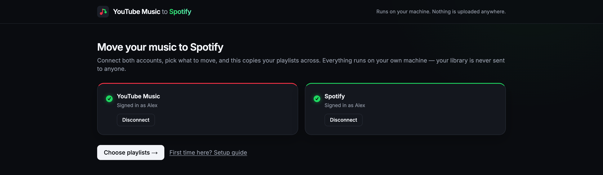
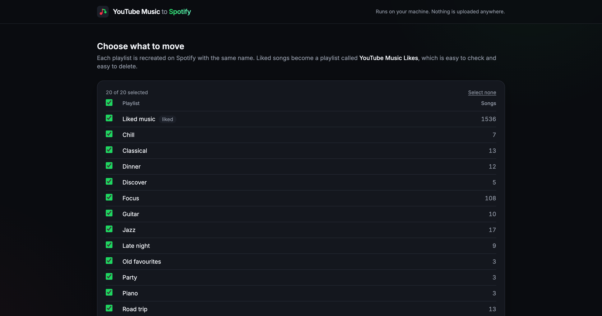
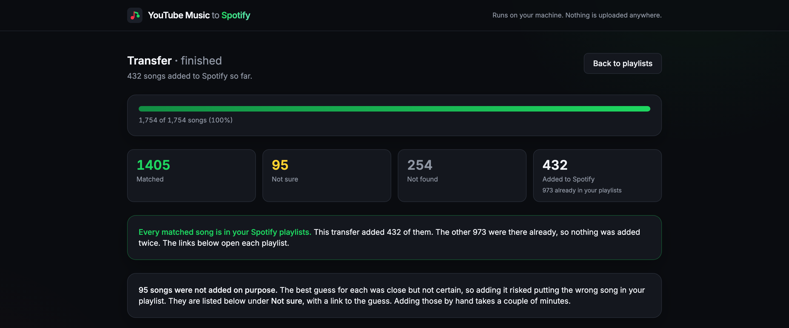
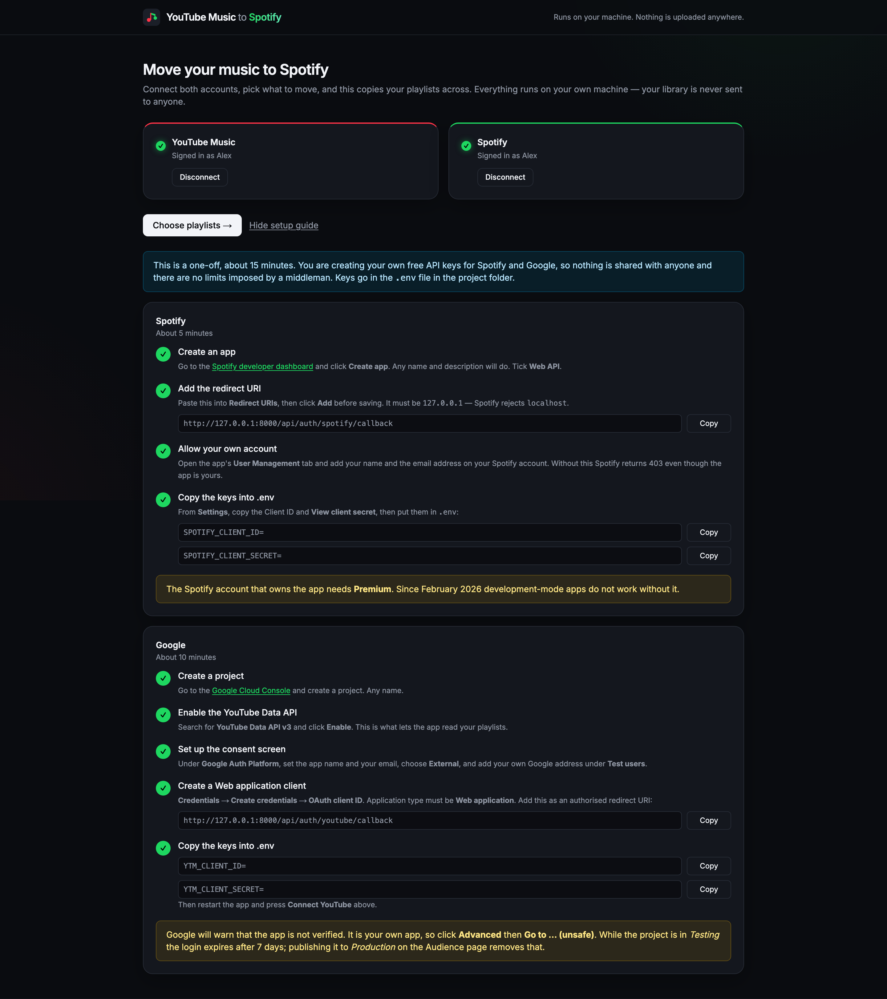

# YouTube Music → Spotify

Move your YouTube Music playlists and liked songs to Spotify. It reads your
library, finds each song on Spotify, rebuilds the playlists, and gives you a
report of everything it could not match.

- **Free.** Open source under the MIT licence. The Spotify and Google
  developer accounts it needs cost nothing.
- **Private.** Runs on your own computer. Your library and your logins never
  leave it.
- **Careful.** A song it is not sure about is held back and listed for you,
  never guessed.



## What it does

1. Reads every playlist and your liked songs from YouTube Music.
2. Searches Spotify for each song and scores how well the result matches.
3. Creates the playlists on Spotify and adds the songs it is sure about.
4. Lists the songs it is not sure about, with a link to its best guess, so
   you can add them by hand in a couple of minutes.

Run it as a **dry run** first. That does all the searching and shows you the
full report without touching your Spotify account. Running it twice is safe:
it reuses a playlist with the same name and skips songs already in it.





## What you need

- **Python 3.11+ and Node 20+.** Check with `python3 --version` and
  `node --version`.
- **A Spotify account with Premium.** Since February 2026 Spotify requires
  this for the account that owns a developer app. A free account cannot run
  it.
- **About 15 minutes, once,** to create your own free Spotify app and Google
  app. There is no shared server, so every user makes their own keys.

## Setup

The Connect screen has this guide built in, with copy buttons for the exact
strings, and it ticks each step off as you go.



### 1. Install

```bash
git clone <your-repo-url>
cd youtube_music_to_Spotify
npm run setup
cp .env.example .env
```

You will paste four keys into `.env` in the next two steps.

### 2. Create a Spotify app (5 minutes)

1. Open the [Spotify developer dashboard](https://developer.spotify.com/dashboard)
   and press **Create app**. Tick **Web API**.
2. Under **Redirect URIs** add this, exactly, and press **Add** before saving:

   ```
   http://127.0.0.1:8000/api/auth/spotify/callback
   ```

   It must be `127.0.0.1`. Spotify rejects `localhost`. This is the most
   common mistake.
3. Open **User Management** and add your own name and Spotify email.
   Without this Spotify refuses your own app with a 403.
4. From **Settings**, copy the Client ID and Client Secret into `.env` as
   `SPOTIFY_CLIENT_ID` and `SPOTIFY_CLIENT_SECRET`.

### 3. Create a Google app (10 minutes)

1. Open the [Google Cloud Console](https://console.cloud.google.com) and
   create a project.
2. Enable the **YouTube Data API v3**.
3. Under **Google Auth Platform**, set the app name and your email, choose
   **External**, and add your own Google address as a **Test user**.
4. **Credentials → Create credentials → OAuth client ID**, type
   **Web application**. Add this authorised redirect URI, exactly:

   ```
   http://127.0.0.1:8000/api/auth/youtube/callback
   ```

5. Copy the Client ID and Client Secret into `.env` as `YTM_CLIENT_ID` and
   `YTM_CLIENT_SECRET`.

### 4. Check it

```bash
npm run check
```

This tests both sets of keys against the real services and names anything
that is wrong.

## Run it

```bash
npm run dev
```

Open `http://127.0.0.1:3000` in your browser. Press `Ctrl+C` in the terminal
to stop.

1. **Connect** both accounts. Each is an ordinary login on Spotify's or
   Google's own website. The app never sees your password.
2. **Choose** the playlists to move. Leave **Dry run** ticked.
3. **Read the report.** Matched, not sure, not found, and a link for each
   guess. Download the CSV if you want to look properly.
4. **Do it for real.** Press **Add matched songs to Spotify**, or untick
   Dry run and run again.

**Big libraries take more than one day.** Spotify allows about 1,000 searches
a day for a personal app, which is roughly 650 songs. The job is saved as it
goes, so when it stops, come back tomorrow and press **Resume**. Nothing is
searched twice. Expect 85–95% of songs to match automatically.

## If something goes wrong

Every error on screen says what happened and what to do next. The ones people
hit most:

| The screen says | What to do |
|---|---|
| Cannot reach the backend | Run `npm run dev` and press **Try again**. |
| Spotify rejected the redirect URI | Compare it to step 2 character by character. `localhost` is the usual slip. |
| Spotify returned 403 Forbidden | Add your email under **User Management** on the dashboard, and check Premium is active. |
| Spotify's daily limit is used up | Wait for the countdown, then press **Resume**. |
| The saved YouTube login has expired | Google expires it after 7 days. Press **Connect YouTube** again. |

Every other failure is explained the same way on screen, with a button for
the next step.

## Security

Your keys live in `.env`, and your login tokens in `backend/data/`. Both are
gitignored. Treat them like passwords: if one ever reaches GitHub, revoke it
on the Spotify dashboard or the Google Cloud Console straight away.

Before you push, run:

```bash
npm run security-check
```

It confirms the secret files are ignored, scans everything git would upload
for your real keys and tokens, and checks the git history too. It never
prints a secret, only where one was found.

## Commands

| Command | What it does |
|---|---|
| `npm run setup` | install everything |
| `npm run dev` | start the app |
| `npm run check` | check your keys and say what is missing |
| `npm run security-check` | make sure no secret is about to reach GitHub |
| `npm test` | run the 168 backend tests |

## How it works

Python and FastAPI on the back, Next.js and TypeScript on the front, both on
your machine. Matching uses title, artist and duration, with penalties for
remixes, live versions and tribute acts, and two thresholds so uncertain
songs are reported instead of added. Spotify allows about 1,000 searches a
day for a personal app, so the job saves as it goes and resumes the next day.
The code is commented for reading; start with `backend/app/matcher.py`.

## Licence

MIT. See [LICENSE](LICENSE). Not affiliated with Spotify, YouTube or Google.
